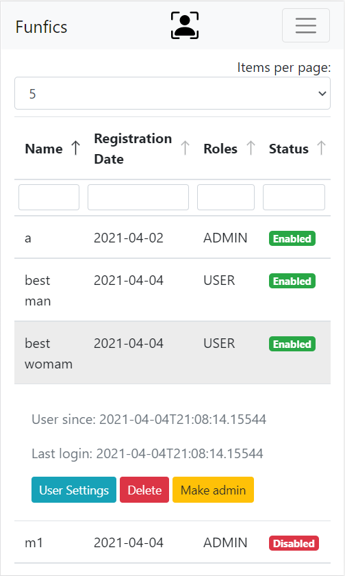

# Funfics

## Admin page

## Funfic page

## Personal funfics

## Info

- [Deployed app on heroku](https://give-me-funfics.herokuapp.com/)
    - Attention! The app can be in the sleeping mode, so it takes time to wake up the server.
- [React frontend project](https://github.com/pochka15/funfics-front)

It's my first React application for a drill project where I tried to make a basic service for creating posts (so called funfics).

## Features

- Markdown posts
- Login/password authentication
- Websocket comments
- Admin page for managing users
- Funfics searchbar